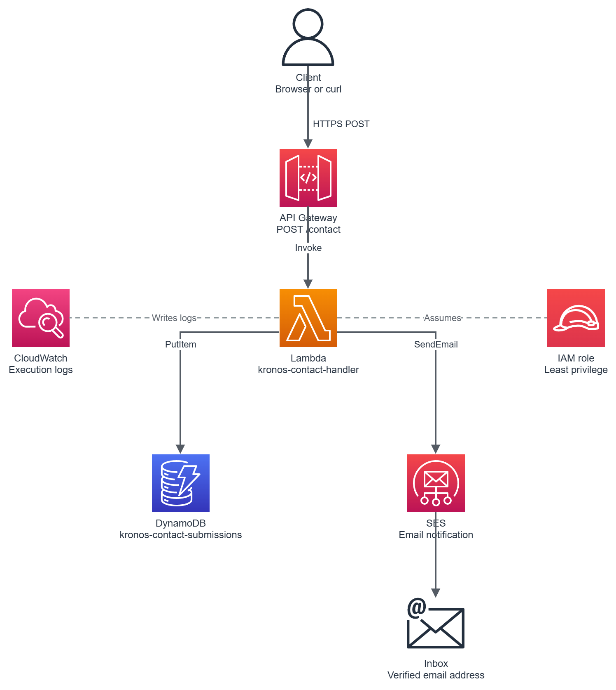

# Kronos Serverless Contact Form API

A serverless contact form backend built on AWS, using API Gateway, Lambda, DynamoDB and SES. This is project 2 in a series of hands on AWS projects I'm building to learn cloud infrastructure properly, aimed at cloud support and cloud engineering roles.



## What it does

Someone sends a POST request with their name, email and message. The request gets validated, saved to DynamoDB, and triggers an email notification through SES so I know someone got in touch. The API gives a different response depending on what actually happened, not just a generic success or fail.

```
Client -> API Gateway -> Lambda -> DynamoDB (saves the message)
                               -> SES (sends me an email)
```

## Services used

| Service | What it does here |
|---|---|
| API Gateway (HTTP API) | The public endpoint. Routes POST /contact to Lambda |
| Lambda (Python 3.14) | Validates the input, writes to DynamoDB, sends the email |
| DynamoDB | Stores each submission, on demand capacity |
| SES | Sends the notification email to my verified address |
| IAM | A role for Lambda with only the permissions it actually needs |
| CloudWatch Logs | Where the execution logs go so I can debug if something breaks |

I went with HTTP API instead of REST API because I didn't need any of the extra REST features like caching or API keys. HTTP API is simpler and cheaper, and it does everything this project needs.

## Some decisions I made and why

**Least privilege IAM.** The Lambda role only has two policies attached. One is the AWS managed policy for CloudWatch logging, the other is a custom policy I wrote myself that only allows PutItem on the one DynamoDB table, and SendEmail on the one SES identity. Nothing is wildcarded.

**Config in environment variables.** The table name and both email addresses are read from environment variables instead of being hardcoded in the function. That way I could point the same code at a different table or address without touching the code itself. Worth noting these aren't secure for actual secrets though, anyone with console access can see them. For real secrets you'd want Secrets Manager or Parameter Store instead.

**Different status codes for different outcomes.**
- 201 if everything worked, saved and emailed
- 202 if it saved but the email failed to send, so the message isn't lost even if SES has a problem
- 400 if the request itself was invalid
- 500 if the database write failed

All the validation happens in Lambda, not in the browser. Client side validation is easy to bypass with a direct request, so the backend has to be the thing that actually checks the data.

**CORS is handled by API Gateway**, not inside the Lambda code, so the browser's preflight OPTIONS request gets answered without even calling the function.

## How I tested it

1. Ran a test event straight from the Lambda console first, checked the response was right and confirmed the item showed up in DynamoDB and the email arrived.
2. Sent a real POST request from PowerShell to the live API Gateway URL, got a 201 back and the email again.
3. Sent an incomplete request (missing fields) to the same live endpoint to check validation actually works and rejects it with a 400, before it ever touches DynamoDB or SES.

## Things I know are limitations

- SES is still in sandbox mode, so it can only send to and from addresses I've verified. Getting out of sandbox needs a request to AWS, not something I needed for a portfolio project.
- I'm sending from a single verified email address rather than a verified domain, so some email clients show "via amazonses.com" next to the sender. That's because Outlook doesn't have an SPF record authorising SES to send on its behalf. Verifying a proper domain with SPF and DKIM would fix this.
- CORS allows any origin (*) right now. In a real deployment I'd lock this down to the actual frontend domain.

## Cost

Everything here stays inside the AWS free tier for the amount of testing I did. Cost so far: £0.

## Tech stack

- Python 3.14
- Built manually through the AWS console, no Infrastructure as Code yet. That's project 5 in this series
- Region: eu-west-2 (London)

## Repo structure

```
.
├── README.md
├── lambda_function.py
├── architecture-diagram.png
└── screenshots/
```

## Part of a bigger series

This is project 2 of 6 I'm building to get hands on with AWS before job hunting seriously:

1. Static site hosting (S3, CloudFront, WAF)
2. Serverless contact form API (this one)
3. CI/CD pipeline
4. Monitoring and alerting (CloudWatch, SNS)
5. Infrastructure as Code (CloudFormation or Terraform)
6. Networking and security (VPC, security groups, EC2)
